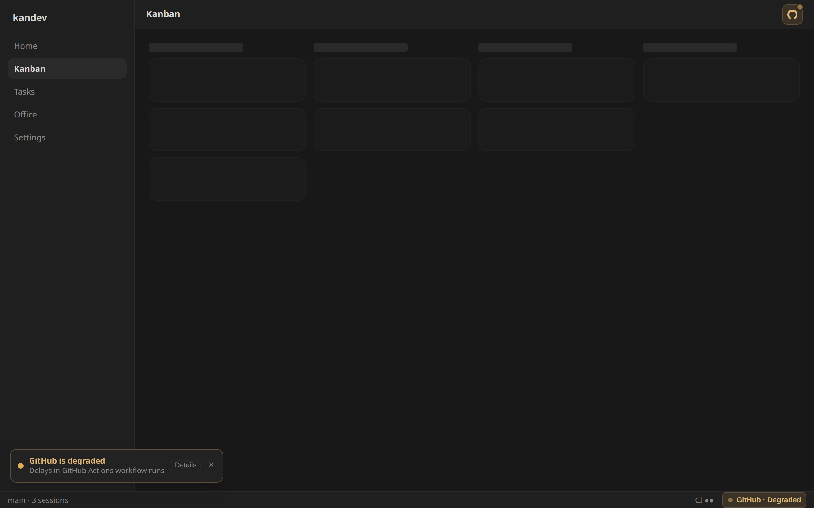
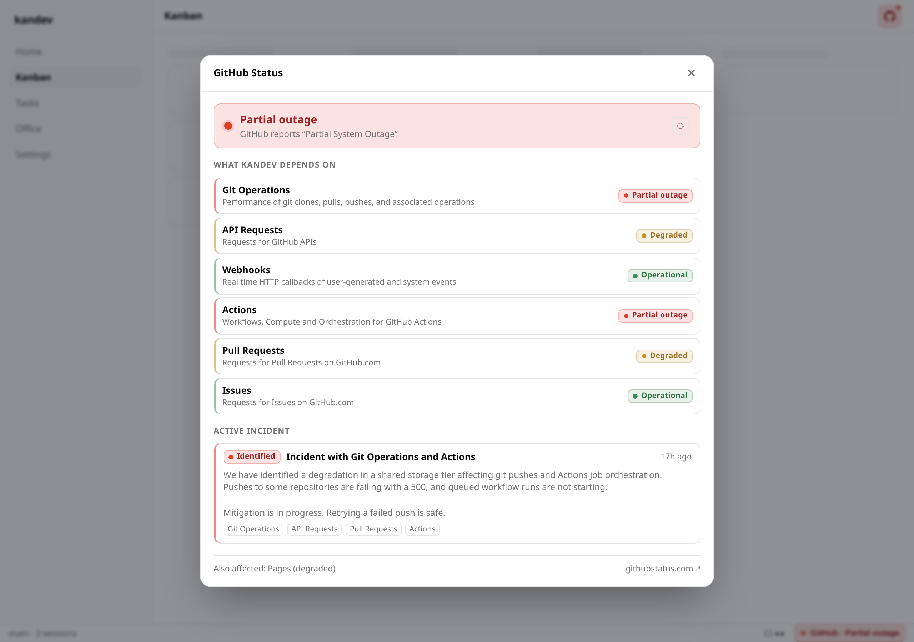
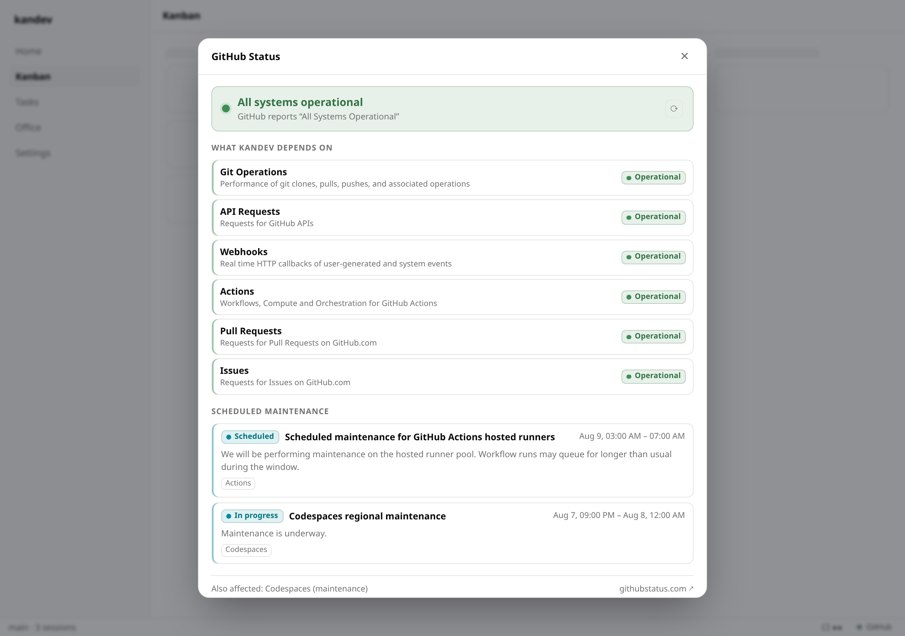

# GitHub Status

> Is it me or is it GitHub?

When a push fails, a clone hangs, or CI never reports, that is the first
question. This plugin answers it from the kandev status bar, without leaving
the app.

It is **quiet when healthy and loud when not**: a recessed dot and the word
"GitHub" while everything works, a colored pill plus an unmissable top-bar
banner the moment something kandev actually depends on degrades.



## What it watches

`githubstatus.com` is a [Statuspage](https://www.atlassian.com/software/statuspage)
instance. The plugin polls its public `summary.json` — components, unresolved
incidents, and scheduled maintenances in one unauthenticated call.

Of the twelve components GitHub publishes, six matter to a kandev user and are
shown prominently:

| Component | Why it matters here |
| --- | --- |
| Git Operations | clone / fetch / push from a task workspace |
| API Requests | everything `gh` and the GitHub integration do |
| Webhooks | PR/CI events reaching kandev |
| Actions | the CI that never reported |
| Pull Requests | PR creation and review flows |
| Issues | issue import and linking |

The rest (Copilot, Codespaces, Packages, Pages, …) are still reported, but
de-emphasized in the modal footer — and, crucially, **they never escalate the
chip**. A Copilot outage is not a reason to paint your status bar red.

## How the severity is decided

```
overall = max(
    severity of the six key components,
    severity of any unresolved incident naming a key component,
)
```

GitHub's own page-level rollup (`status.indicator`, "Partial System Outage") is
displayed for context but deliberately does **not** drive the color. Two
consequences worth knowing:

- An outage confined to non-key components leaves the chip quiet, even while
  githubstatus.com shows a red banner.
- An incident opened before GitHub flips the component statuses — which is the
  common case, they lag by minutes — escalates immediately.

Planned maintenance sits in its own quiet band: reported in the modal, never
loud, never notified.

## Surfaces

| Slot | When | What |
| --- | --- | --- |
| `app-status-bar-right` | always | Dot + "GitHub", muted while healthy; a severity-colored pill when not. Click to open the modal. |
| `main-top-bar` | only when degraded | A severity-tinted GitHub mark with a pulsing pip on Home / Kanban / Tasks — one 32×32 icon button, the same footprint as its neighbours. Renders nothing at all while healthy. |
| `chat-top-bar` | only when degraded | The same incident indicator in the top bar of an open task. |
| modal | on click | Overall status, the six key components, active incidents (impact, status, latest update, timestamp), upcoming maintenance, and a link out. |
| toast | only on a transition | "GitHub is degraded" / "GitHub is back to normal", once per change. |
| `plugin-settings` | Settings → Plugins | The notification toggle. |

<table>
<tr>
<td width="50%"></td>
<td width="50%"></td>
</tr>
<tr>
<td><em>Active incident — light</em></td>
<td><em>Scheduled maintenance stays quiet</em></td>
</tr>
</table>

More states in [`docs/`](docs/): `app-healthy`, `app-degraded`, `app-stale`,
`modal-critical-dark`, `modal-incident-dark`, `settings`, and their dark
counterparts. `real-app-*.png` are the same surfaces captured from an actual
running kandev instance with the plugin installed, rather than from the
offline harness.

## Being a good network citizen

Everything below is in `server/poller.go` and covered by `server/poller_test.go`:

- **One poller per install, not per tab.** The browser calls this plugin's own
  `status` webhook; only the backend talks to githubstatus.com.
- **60s floor.** githubstatus.com advertises `Cache-Control: max-age=10`. We
  decline to take it up on that. If a provider ever asks for *longer* than 60s,
  that wins (capped at 15 minutes).
- **Conditional GETs.** `ETag` / `If-None-Match` and `Last-Modified` /
  `If-Modified-Since`, so a steady status page costs a 304 and no body.
- **Identifying User-Agent**, so the operators can see who is calling.
- **Exponential backoff** on failure: 60s → 2m → 4m → 8m → 15m, reset on the
  next success.
- **Last good response is cached** and shown as *stale* — a single failed fetch
  never flaps the chip to "unknown".

## Transitions and notifications

The toast fires **only on a change**, never on every poll. A two-hour outage
produces exactly two toasts: one when it starts, one when it clears.

The rules live in `server/transition.go`:

- No baseline yet (first poll ever) → never notify.
- Same overall severity → never notify, even if the incident text, affected
  components, and timestamps all changed underneath.
- A change entirely inside the quiet band (operational ↔ maintenance) → never
  notify.
- Otherwise notify, classified `degraded` / `recovered` / `escalated` /
  `improved`.

The last-notified severity is persisted in Host state, so restarting kandev
mid-outage does not replay a toast you already dismissed. Delivery to the
browser is a pending transition on the status payload, acknowledged by a stable
id — which is what stops a page reload from re-toasting.

> **A note on `EmitEvent` → `registerWsHandler`:** the plugin does call
> `Host.EmitEvent`, publishing `plugin.kandev-plugin-github-status.status.changed`
> so other plugins can subscribe. It is **not** what drives the toast. On the
> current kandev branch `EmitEvent` publishes to the backend event bus only —
> there is no generic bridge forwarding `plugin.<id>.<name>` subjects to the
> browser WebSocket, so `registerWsHandler` cannot observe it. Hence the
> payload-plus-ack delivery above. If that bridge ever lands, the UI can switch
> to it without changing the backend.

## Seeing the degraded states

GitHub is up essentially all of the time, so the interesting UI is otherwise
unreachable. Five fixtures (a verbatim capture plus four derived from it) cover
it — see [`server/fixtures/README.md`](server/fixtures/README.md).

Against a running kandev instance, append `?ghsDemo=<name>` to the app URL:

```
http://localhost:38429/?ghsDemo=incident
```

...where `<name>` is `healthy`, `degraded`, `incident`, `critical`,
`maintenance`, or `stale`. The chip, the banner, and the modal all switch to
the fixture. Remove the parameter to go back to live data.

Or run the offline render harness, which loads the real `ui/bundle.js` and
`ui/plugin.css` against the real backend payloads and kandev's real theme
tokens:

```bash
python3 -m http.server 8791          # from the repo root
open 'http://127.0.0.1:8791/docs/harness/index.html?state=incident&theme=dark&view=modal'
# ?state=healthy|degraded|incident|critical|maintenance|stale
# &theme=light|dark  &view=app|modal|settings  &toast=1
```

Regenerate the harness payloads after changing the backend:

```bash
GHS_DUMP_DEMO=../docs/harness go test ./server/ -run TestDumpDemoJSON
```

## Adding another provider (later)

Every Statuspage-backed service — GitLab, npm, Anthropic, OpenAI — serves this
exact API shape. `server/sources.go` is a table:

```go
{
    ID: "gitlab", DisplayName: "GitLab",
    SummaryURL: "https://status.gitlab.com/api/v2/summary.json",
    PageURL:    "https://status.gitlab.com",
    KeyComponents: []string{...},
    Enabled: true,
}
```

The fetch, parse, severity, transition, and persistence layers are all
per-source already. **This release ships GitHub as the only enabled source on
purpose** — which other providers belong in a kandev status bar is a product
decision, not a config default to flip. The single-provider UI reads
`primarySource()`; enabling a second one is the point where the chip and modal
need a per-source list, and that function marks the seam.

## Capabilities

```yaml
capabilities:
  state: true
```

That is the whole list. The plugin reads one public, unauthenticated JSON
endpoint and never touches kandev's tasks, sessions, messages, repositories, or
secrets. `state` persists two small objects: the notification preference and
the per-source notification baseline.

## Development

Built against a sibling checkout of the kandev monorepo — `go.mod` has
`replace github.com/kandev/kandev => ../kandev/apps/backend`, so this repo
expects `../kandev` next to it.

```bash
go test ./server/...      # 59 test functions, 79 runs incl. subtests
go vet ./server/...
gofmt -l .
make package-host         # host platform only, fast local loop
make package              # all five platforms in manifest.yaml
```

CI (`.github/workflows/ci.yml`) runs tidy + gofmt + vet + test on every PR,
and `build.yml` packages all five platforms. Both check out `kdlbs/kandev`
as a sibling so the `replace` in `go.mod` resolves. `release.yml` is manual
(`workflow_dispatch` with a patch/minor/major bump, or a `v*` tag push): it
syncs `manifest.yaml`/`Makefile`/README, writes `CHANGELOG.md`, tags, then
publishes `kandev-plugin-github-status-<version>.tar.gz` plus `checksums.txt`
to the GitHub Release.

### Installing into a running instance

```bash
curl -F "package=@kandev-plugin-github-status-0.1.0.tar.gz" \
  http://localhost:38429/api/plugins/install
```

On an instance with authentication enabled, use **Settings → Plugins → Install**
instead, or drop the tarball into `~/.kandev/plugins/` and press **Sync** on that
page — kandev runs it through the same verified install pipeline and deletes the
file on success. No restart is needed either way.

Reinstalling the same id *and* version is rejected; bump `version` in
`manifest.yaml` (and the `VERSION` in the `Makefile`) or uninstall first.

## Layout

```
manifest.yaml            identity, capabilities, webhooks, UI paths
server/
  main.go                starts the poller, then pluginsdk.Serve
  sources.go             the provider table (GitHub only, enabled)
  statuspage.go          summary.json -> Severity + Snapshot (pure)
  transition.go          the "only notify on change" rule (pure)
  poller.go              60s / ETag / backoff / stale cache
  settings.go            Host-state persistence + the settings object
  plugin.go              the status / ack / settings webhooks
  demo.go                fixture serving for ?demo=
  fixtures/              five summary.json payloads
ui/
  bundle.js              chip, banner, modal, toast, settings panel
  plugin.css             severity tokens derived from host theme tokens
docs/harness/            offline render harness for screenshots
```

## Design notes

- **Colors are derived, never hardcoded.** Every severity token is a
  `color-mix()` over kandev's own `--success` / `--warning` / `--destructive` /
  `--info` / `--border`. There is no second palette to keep in sync with the
  host, and dark mode is free.
- **Sits next to CI Monitor, does not overlap it.** CI Monitor answers "did *my*
  PR's checks pass". This answers "is the provider up". Same pastel pill
  vocabulary, same row/rail/pill shapes, adjacent question.
- **No tooltips in the modal.** `host.ui` has no `TooltipProvider` inside modal
  content on this branch, so every label is rendered inline.
- **The top-bar indicator is an icon button, not a banner.** The
  `main-top-bar` slot lives in the host's actions row — `shrink-0`, otherwise
  a run of 32×32 icon buttons, and it overlays the centred task-search input
  as it grows. A labelled pill there was ~190px: it crowded the bar and
  covered the search box. It is now one more 32×32 button, so the row grows
  176px → 216px instead of 176px → 536px. It is unmissable by being the only
  coloured, pulsing thing among monochrome icons rather than by being large;
  the words live in the status-bar chip, the hover title, and the modal.
- **The toast stack is bottom-left.** kandev's own toast container is a fixed
  360px column at bottom-right; two stacks sharing that anchor overlap, so this
  one takes the opposite corner at the same vertical offset.
- **Line heights are set, not inherited.** The toast stack is rendered by the
  status-bar chip, so it lives inside kandev's `leading-none` status bar. An
  inherited `line-height: 1` makes the line box shorter than the glyph box,
  and combined with the ellipsis `overflow: hidden` that shears the descenders
  off text like "Widespread outage affecting github.com". Anything this plugin
  renders into host chrome sets its own `line-height`.
